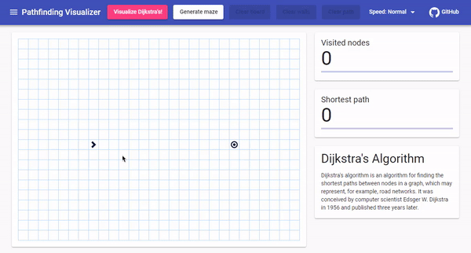
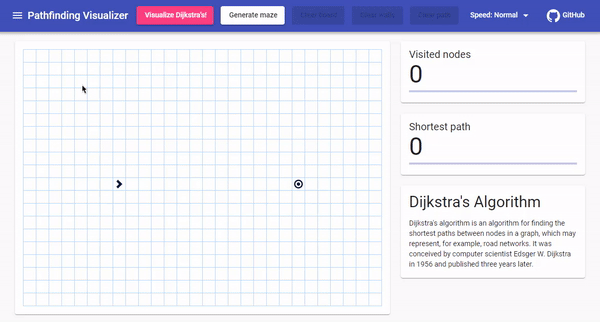
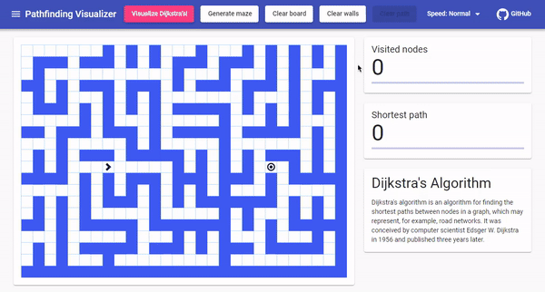
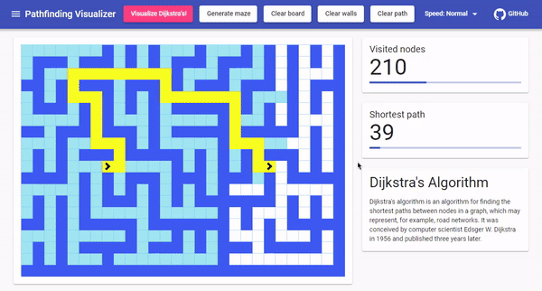
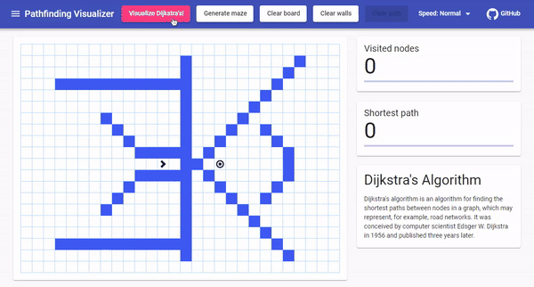
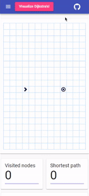

# Pathfinding Visualizer

Technology stack used:

<a href="https://carlos-dubon.github.io/pathfinding-visualizer/" target="_blank">https://carlos-dubon.github.io/pathfinding-visualizer/</a>

A visualization tool for **Dijkstra’s pathfinding algorithm** and **Prim’s maze generation algorithm**. Find the shortest path from a source to a destination. This project is based on graph theory.

## Dijkstra's algorithm 
Dijkstra's algorithm is an algorithm for finding the shortest paths between nodes in a graph, which may represent, for example, road networks.

It was conceived by computer scientist Edsger W. Dijkstra in 1956 and published three years later.

## Prim's algorithm
Prim's algorithm is a greedy algorithm that finds a minimum spanning tree for a weighted undirected graph.

The algorithm was developed in 1930 by Czech mathematician Vojtěch Jarník and later rediscovered and republished by computer scientists Robert C. Prim in 1957 and Edsger W. Dijkstra in 1959.

## Difference between Dijkstra's algorithm and Prim's algorithm

Dijkstra’s algorithm finds the shortest path, but Prim’s algorithm finds the Minimum Spanning Tree (MST).

In practice, Dijkstra’s algorithm is used when we want to save time and fuel traveling from one point to another. Prim’s algorithm, on the other hand, is used when we want to minimize material costs in constructing roads that connect multiple points to each other.

## Features

- ### Drag and drop nodes
    Drag and drop the nodes across the grid.

    

- ### Toggle walls
    Click on the grid to add a wall. Walls are impenetrable, meaning that a path cannot cross through them.

    

- ### Generate random mazes
    Generate random mazes with Prim's algorithm. You are guaranteed to get a path from the source to the target with every maze generated.

    

- ### Visualize Dijkstra's pathfinding algorithm
    See Dijkstra's pathfinding algorithm in action, and visualize how it gets to find the shortest path between nodes in a graph.

    

- ### Visualize different outcomes
    Move the nodes once the algorithm is done, add or remove walls from the grid. This will allow you to see different paths.

    

- ### Get creative!
  
    

- ### Change the speed of the algorithm
  
    

- ### Mobile friendly
  
    

I hope you have just as much fun playing around with this visualization tool as I had building it!